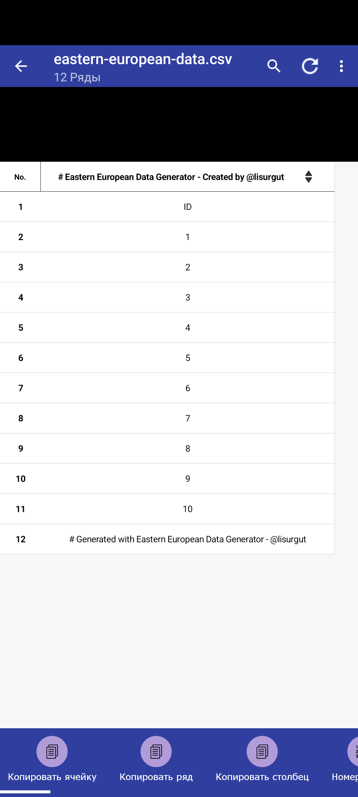

# MHJTGen

<div align="center">
  




</div>

## О проекте

**MHJT** представляет собой профессиональный инструмент для создания реалистичных персональных данных, соответствующих форматам стран Восточной Европы. Приложение генерирует аутентичные имена, телефонные номера, адреса и паспортные данные для России, Украины, Польши и Беларуси с учетом региональных особенностей и форматирования.

## Особенности

**MHJTGen** предлагает ряд функциональных возможностей:

**Мгновенная генерация данных** - получение персональных данных происходит за миллисекунды, что обеспечивает высокую производительность при работе даже с большими объемами записей.

**Поддержка нескольких стран** - приложение включает поддержку России, Украины, Польши и Беларуси с соблюдением национальных особенностей форматирования и структуры данных.

**Гибкие настройки генерации** - возможность выбора конкретных полей и объема данных позволяет получать именно ту информацию, которая требуется в конкретном случае.

**Настраиваемое соотношение полов** - инструменты для управления распределением мужских и женских записей в сгенерированных данных.

**Экспорт в различные форматы** - поддержка CSV и TXT форматов для удобного использования сгенерированных данных в других системах и приложениях.

**Современный интерфейс** - темная тема с высоким контрастом обеспечивает комфортную работу с приложением в течение длительного времени.

## Технологии

<div align="center">
  


</div>

## Установка и запуск

Для установки и запуска приложения выполните следующие команды:

```bash
# Клонирование репозитория
git clone https://github.com/username/MHJTGen.git
cd MHJTGen

# Установка зависимостей
npm install

# Запуск в режиме разработки
npm run dev
```

## Инструкция по использованию

Процесс генерации данных состоит из следующих шагов:

1. Выберите страну из выпадающего списка (доступны Россия, Украина, Польша и Беларусь)
2. Укажите требуемое количество записей с помощью слайдера (диапазон от 1 до 100 записей)
3. Выберите необходимые поля для генерации (имя, телефон, адрес, паспорт)
4. Настройте параметры имени (имя, фамилия, отчество)
5. Установите соотношение полов с помощью слайдера
6. Нажмите кнопку "Сгенерировать данные"
7. При необходимости, экспортируйте результаты в CSV или TXT формат

## Примеры данных

| Имя | Телефон | Адрес | Паспорт |
|-----|---------|-------|---------|
| Смирнова Анна Ивановна | +7 (985) 123-45-67 | г. Москва, ул. Ленина, д. 15, кв. 42 | 4512 765432 |
| Ковальчук Олег Петрович | +380 (67) 987-65-43 | м. Київ, вул. Хрещатик, б. 22, кв. 15 | СН 654321 |
| Nowak Jan Karol | +48 512 345 678 | ul. Marszałkowska 15/22, Warszawa | ABD 12345678 |
| Іванова Марыя Пятроўна | +375 (29) 765-43-21 | г. Мінск, вул. Няміга, д. 5, кв. 12 | AB 1234567 |

## Настройки отображения

Приложение предоставляет возможность настройки отображения через меню настроек:

Плотность отображения данных - выбор между компактной, комфортной и просторной плотностью отображения.

Формат даты - возможность выбора предпочтительного формата отображения даты (ДМГ, МДГ, ГМД).

Размер шрифта - настройка размера шрифта для обеспечения оптимальной читаемости.

## API Endpoints

Приложение предоставляет следующие API endpoints:

```
GET  /api/generate - генерирует данные по указанным параметрам
POST /api/export   - экспортирует данные в выбранный формат
```

## Разработчики

<div align="center">
  
Проект разработан командой [Lisurgut](https://github.com/lisurgut)


</div>

## Лицензия

Проект распространяется под лицензией MIT. Более подробную информацию можно найти в файле [LICENSE](LICENSE).

---

<div align="center">
  
  **[Наверх](#MHJTGen)**
  
</div>